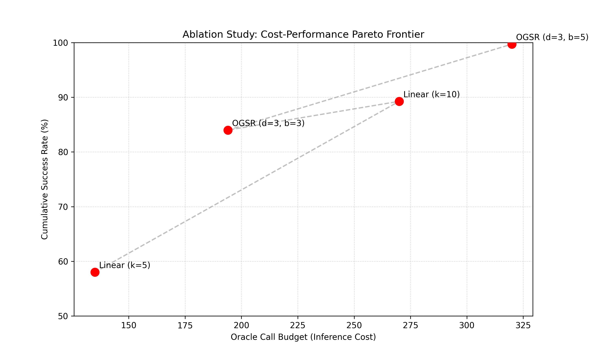

# Oracle-Grounded AI Scientist (OGAS) — reviewer-facing README

This repository accompanies the manuscript **“Oracle-Grounded AI Scientist (OGAS): Retrieval Grounding for Scientific Code Assistants, with an ATLAS Higgs-Challenge Replication Testbed.”**  
This document is written for reviewers at venues such as **NeurIPS / ICML workshops**: what is claimed, what is measured, how it is implemented, and how to reproduce it.

**Naming note (repository paths vs venue):** several filenames retain legacy **`neurips`** prefixes (for example `run_neurips_pipeline.py`, `paper/neurips_rag_atlas.tex.j2`, `rag_queries_500_neurips_mirror.jsonl`). These refer to the **shared manuscript / PDF pipeline** developed for an evaluations-style submission and are **not** venue-specific logic: if your camera-ready target is the **ICML AI for Science Workshop** (or similar), treat them as the **workshop manuscript pipeline** unless you rename files repo-wide.

---

## One-sentence summary

We evaluate **Oracle-Grounded AI Scientist (OGAS)**, a framework that combines retrieval with **deterministic oracles** to improve scientific code correctness; notably, our **OGSR** strategy (**Oracle-Guided Sequential Refinement**) raises cumulative task success for **Llama-3.1-70B** from **58%** (linear retry at \(k{=}5\)) to **84%** under the same oracle-call budget reporting used in the paper (strict domain-specific micro-tasks).

---

## Contributions (mapped to the paper)

1. **Evaluation contract for scientific RAG** — Hand-authored queries with path-pattern gold labels, aggregate and stratified metrics (Recall@\(k\), MRR, nDCG@\(k\)), optional lexical checks or RAGAS-style LLM-judge scores, and **published failure cases** when gold documents never appear in the top-\(k\) retrieval list.

2. **Validation testbed (ATLAS Higgs Boson ML Challenge, 2014)** — Weighted training, sentinel missingness (\(-999 \rightarrow\) NaN), AMS with regulator \(b_r{=}10\), stratified K-fold reporting. Demonstrates that the **same references** the assistant indexes align with an executable pipeline (not a leaderboard claim on private test labels).

3. **OGSR (Oracle-Guided Sequential Refinement)** — \(N{=}50\) micro-tasks (AMS closed-form, weighted log-loss, nDCG@\(k\), AMS threshold scan) with **deterministic oracles** and JSONL task definitions. Compares **linear retry** (pass@\(k\)) vs **OGSR** under controlled oracle-call budgets.

4. **Reproducibility tooling** — Configuration-driven ingest (`configs/references.yaml`), scripts under `evals/` and `run_neurips_pipeline.py`, and LaTeX generation from `paper/neurips_rag_atlas.tex.j2`.

---

## Scope and non-claims

- **Retrieval metrics are corpus-specific.** Numbers transfer only together with the **embedding checkpoint**, **chunking settings**, and **indexed snapshot** recorded in each eval JSON.
- **Path-pattern relevance is a proxy** for “correct document family” when stable chunk IDs across re-ingests are unavailable.
- **ATLAS validation AMS** is **not** the private competition leaderboard score; we report **stratified K-fold** metrics on the public training table as a **scientific consistency check** between indexed methodology and executable code—not as a competition leaderboard claim.
- **OGSR** targets **small scientific numerical utilities**, not full repository-scale software engineering.

---

## Repository map

| Path | Role |
|------|------|
| `paper/neurips_rag_atlas.tex.j2` | Manuscript template (Jinja placeholders filled by `run_neurips_pipeline.py`; legacy `neurips` filename—see note above) |
| `run_neurips_pipeline.py` | Manuscript pipeline: retrieval eval (optional), ATLAS replication, PDF/LaTeX render |
| `run_atlas_pipeline.py` | ATLAS challenge baseline (weighted boosting, AMS, figures, metrics JSON) |
| `evals/run_retrieval_eval.py` | Main retrieval evaluation CLI |
| `evals/retrieval_eval_lib.py` | Metrics + aggregation + optional RAGAS hooks |
| `evals/judge_metrics.py` | Optional LLM-judge (OpenAI / OpenRouter paths documented in code) |
| `evals/ogts/run_ogsr_eval.py` | OGSR harness CLI (strategy flag `ogsr`; `ogts` kept as alias) |
| `evals/ogts/strategies.py` | **Authoritative** implementation of linear retry vs OGSR |
| `evals/ogts/data/ogts_50_tasks.jsonl` | Frozen 50-task suite |
| `evals/README.md` | Retrieval harness details (RAGAS, embedding sweep, gold JSONL format) |
| `configs/references.yaml` | Corpus manifest for indexing |
| `croissant.json` | Dataset / artifact metadata (where applicable) |
| `simulation_ogts.py` | Optional matplotlib sketch for the cost–success Pareto figure (`pareto_frontier.png`; legacy script name) |

Pedagogical Jupyter workflows and CSV provenance remain documented under **`notebooks/README.md`** and **`data/PROVENANCE.md`** (orthogonal to the paper’s core claims).

---

## Evaluation axis 1 — Retrieval (summary)

- **Inputs:** Chroma persist dir + embedding model id matching the index; gold queries JSONL (`evals/data/` — starter set or generated `rag_queries_500_neurips_mirror.jsonl`).
- **Outputs:** JSON under `evals/results/` with aggregates, per-difficulty breakdowns, per-query rows, and failure-case metadata when no gold path appears in top-\(k\).

**Full commands and RAGAS costs:** see **`evals/README.md`**.

Minimal reproduction (after indexing):

```bash
pip install -r evals/requirements-eval.txt
python evals/run_retrieval_eval.py \
  --rag-db ./.cursor/rag_db \
  --k-list 5 10 \
  --queries evals/data/rag_queries.jsonl \
  --output evals/results/reviewer_retrieval.json
```

---

## Evaluation axis 2 — ATLAS replication (summary)

```bash
pip install -r requirements-pipeline.txt   # project venv recommended
export MPLCONFIGDIR="$PWD/.mplcache"
python run_atlas_pipeline.py --no-compile   # fast dev default uses subsample; see script --help for --full-train
```

Writes figures and **`output/atlas_challenge/metrics.json`** (and LaTeX bundles under `output/atlas_*`). Metrics in the paper are **mean ± std over stratified K-fold** on the training table (`KaggleSet=t`), not private test AMS.

---

## Evaluation axis 3 — OGSR (what reviewers should verify)

### Task format

Each line in `evals/ogts/data/ogts_50_tasks.jsonl` defines:

- Natural-language **prompt**,
- Python **entrypoint** name,
- **Oracle kind** (`numeric_equal`, `numeric_close`, `json_equal`),
- **`oracle_payload`** with fixed test cases (arguments + expected outputs).

The oracle **imports the generated module**, calls the entrypoint on each case, and aggregates pass/fail + score (`evals/ogts/oracles.py`).

### Strategy A — Linear retry (pass@\(k\))

For each task:

1. Repeat up to \(k\) times: sample code from the LM using the **original prompt only** (no feedback between failures).
2. Stop at the **first** module that passes all oracle cases.
3. If none pass, report best score achieved.

So failures are “caught” **only** by executable tests; there is **no** prompt refinement from oracle output.

### Strategy B — OGSR (as implemented in this repo)

Parameters: **depth** \(d\) (sequential refinement stages), **branch** \(b\) (parallel candidates **within** each stage), sampling temperature \(T\).

For each depth level \(1 \ldots d\):

1. **Expand:** Sample \(b\) **independent** candidate modules from the **current prompt** `ctx` (parallel siblings **at this stage only**).
2. **Evaluate:** Run the oracle on **every** candidate. **Count each oracle run** (`oracle_calls` in logs).
3. **Early exit:** If **any** candidate passes, stop immediately (success).
4. **Greedy collapse:** If none pass, sort candidates by oracle **score**, keep **only the single highest-scoring** failure.
5. **Refine:** Set `ctx` to the **original task prompt** plus a short fixed suffix containing **`Status: <best_failure.status>`** (oracle status string only — not full tracebacks, not per-case diffs).
6. Proceed to the next depth with this new `ctx`.

**What is *not* done:** This is **not** beam search retaining multiple competing hypotheses across depths. Only **one** lineage survives refinement after each stage. Alternative siblings are **discarded** for deeper refinement—hence **greedy collapse**, not a retained beam of partial programs.

**Why this still matters:** Parallel width \(b\) explores diverse corrections at each stage; oracle scores gate which failure message informs the next prompt. The paper’s **nDCG family** example illustrates **near-perfect numeric overlap with systematic misuse of rank indexing** — invisible to lexical grounding but exposed by execution.

### Running OGSR

```bash
pip install openai   # OpenAI SDK; used also for OpenRouter-compatible base_url
# Smoke (no API key):
python evals/ogts/run_ogsr_eval.py --generator dummy --max-tasks 2

# Example OpenRouter (see evals/ogts/generators.py for env vars & model IDs):
export OPENROUTER_API_KEY='…'
python evals/ogts/run_ogsr_eval.py \
  --generator openai \
  --model anthropic/claude-3.7-sonnet \
  --tasks evals/ogts/data/ogts_50_tasks.jsonl \
  --k 5 --depth 3 --branch 3 \
  --output evals/ogts/results/ogsr_eval_run.json
```

(`--strategies ogsr` is the default alongside linear retry; `--strategies ogts` remains an **alias**.)

### Illustrative Pareto plot (`simulation_ogts.py`)

`simulation_ogts.py` is **not** part of the OGSR evaluation harness. It is a small **matplotlib helper** for an ablation-style figure: **oracle-call budget (horizontal)** vs **cumulative success rate (vertical)** when comparing **linear retry** (pass@\(k\) with independent tries) to **OGSR-style budgets** under a simplified probability model (comments reference **Appendix A.1** notation in the manuscript).



- **Linear retry curve:** uses \(P_k = 1 - (1-p)^k\) with base success rate \(p\) (script default \(p=0.2\)).
- **OGSR toy curve:** implements recursive “success-or-advance” bookkeeping from the appendix toy model (`prob_ogsr` in code — depth \(d\), branch \(b\), per-stage effective \(p_i\) capped by refinement factor \(r\)).
- **Scatter points:** the script mixes **hard-coded empirical rates** from reported experiments (including **58%** linear \(k{=}5\) and **84%** OGSR \((d,b)=(3,3)\) for Llama-3.1-70B in the strict micro-task suite) with **values computed from the formulas** (e.g. linear \(k{=}10\), OGSR \((5,3)\)) so the dashed connector reads as a qualitative **cost–performance frontier**, not a rerun of `run_ogsr_eval.py`.

Outputs **`pareto_frontier.png`** in the current working directory (typically the repo root).

```bash
pip install matplotlib            # if not already installed
export MPLBACKEND=Agg             # optional: headless / CI / SSH without a display
python simulation_ogts.py
```

Edit the `configs` list inside `simulate_pareto()` if table numbers or budgets change in the paper.

---

## Manuscript pipeline (NeurIPS-style filenames)

```bash
pip install -r evals/requirements-eval.txt
export MPLCONFIGDIR="$PWD/.mplcache"
python run_neurips_pipeline.py --no-compile
```

Options commonly used in split environments:

- `--skip-eval` — ATLAS + LaTeX only (no Chroma).
- `--reuse-eval-json path/to.json` — inject a frozen retrieval JSON into the manuscript.

Automated index + eval + paper:

```bash
scripts/build_rag_and_paper.sh
```

See comments in **`scripts/build_rag_and_paper.sh`** for `SKIP_INDEX`, `SKIP_EVAL`, and Overleaf sync.

---

## Limitations (explicit)

- **OGSR refinement signal is intentionally minimal** (status string). Richer feedback (per-case oracle diffs) would likely change refinement effectiveness and is left to future work.
- **50 tasks, four families** — generalization beyond these scientific micro-patterns is not claimed.
- **RAGAS / LLM judges** introduce cost, variance, and provider dependence when enabled.
- **Anonymized submission:** scrub absolute user paths and API keys from any JSON you bundle as supplementary material.

---

## Ethics / data

Public challenge CSV and open methodology references are documented in **`docs/atlas_higgs_challenge_scaffolding.md`** and **`croissant.json`** where applicable. Do not commit secrets; use environment variables only.

---

## Citation

Use the citation block from the camera-ready paper once available. Until DOI assignment, cite **repository + commit SHA + eval JSON timestamps** alongside embedding model ids for any numerical claim.

---

## Maintainer note

If this README and `paper/neurips_rag_atlas.tex.j2` diverge, treat **`evals/ogts/strategies.py`** and **`evals/retrieval_eval_lib.py`** as ground truth for algorithmic behavior.

---

## Additional materials (outside the paper’s core claims)

- **Tier-2 Jupyter + CSV pedagogy:** `notebooks/README.md`
- **CSV inventory / provenance:** `data/PROVENANCE.md`
- **Higgs-style CSV peak-search pipeline:** `docs/higgs_csv_methodology.md`, `run_higgs_pipeline.py`
- **Legacy combined ops notes** (Overleaf, venv quirks) remain recoverable from git history if needed; this README is intentionally **reviewer-first**.
